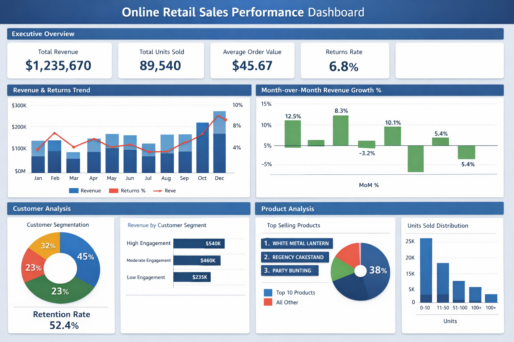
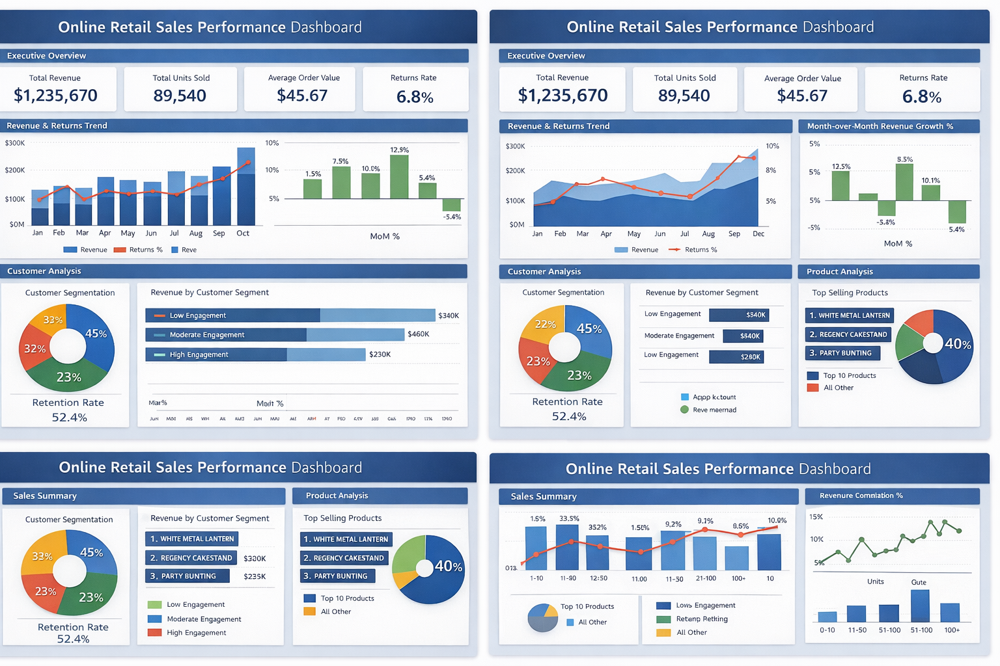

# 📊 Online Retail Analytics – End-to-End Data Project

## 📌 Project Overview

This project analyzes transactional retail data (2009–2011) and builds a complete analytics pipeline:

1. Data extraction and cleaning (Python ETL)
2. SQL-based analytics layer (SQLite Data Mart)
3. KPI modeling using DAX
4. Interactive dashboard in Power BI

The objective is to transform raw transactional data into business-ready insights around revenue, customer behavior, product performance, and returns.
---

# 📂 Raw Dataset Preview

The project is based on transactional retail data containing invoice-level purchase records. The dataset includes product details, quantities, pricing information, customer identifiers, invoice timestamps, and country-level data.

Key columns in the dataset:

- Invoice  
- StockCode  
- Description  
- Quantity  
- InvoiceDate  
- Price  
- Customer ID  
- Country  

This raw data serves as the foundation for the ETL process, SQL analytics layer, and Power BI dashboard development.

  

---

---

# 🏗 Project Architecture

Excel Data  
↓  
Python ETL (Cleaning + Feature Engineering)  
↓  
SQLite Database  
↓  
SQL Analytics Data Mart  
↓  
Power BI (DAX + Dashboard)

---

# 🛠 Tech Stack

- Python (Pandas, SQLite3)
- SQL (SQLite)
- Power BI
- DAX
- Excel

---

# 🔄 1. ETL Pipeline

**File:** `online_retail_etl_pipeline.py`

### Key Steps:
- Combined yearly Excel sheets
- Removed missing values and duplicates
- Converted date columns to datetime format
- Created time-based features (Year, Month, Week, Quarter)
- Standardized column names for SQL compatibility
- Exported cleaned data into SQLite database

**Output:**  
`online_retail_clean.db`

---

# 📊 2. Analytics Data Mart

**File:** `retail_analytics_data_mart.py`

Generated structured datasets for BI consumption:

- `sales_summary.csv`
- `products_by_quantity.csv`
- `customer_activity.csv`
- `returns_summary.csv`

This layer separates raw data from reporting logic and prepares datasets specifically for Power BI.

---

# 📈 3. Power BI KPI Measures

**File:** `sales_performance_kpi_measures.dax`

### Core KPIs Implemented:

- Total Revenue  
- Total Units Sold  
- Invoice Count  
- Revenue per Customer  
- Average Order Value  
- Returns Percentage  
- Revenue per Product  
- Customer Retention Rate  
- Month-over-Month Revenue Growth  
- Revenue Contribution %

### DAX Concepts Used:

- `DIVIDE()` for safe calculations
- Time Intelligence (`DATEADD`)
- Context modification using `ALL`
- Customer segmentation using `SWITCH(TRUE())`

---

# 📊 Dashboard Structure

### 1️⃣ Executive Overview
- Revenue KPIs
- MoM Growth
- Returns %
- Average Order Value

### 2️⃣ Customer Analysis
- Engagement segmentation
- Retention rate
- Revenue by customer tier

### 3️⃣ Product Analysis
- Top products by revenue
- Revenue contribution %
- Quantity distribution

(Power BI dashboard)

---

# 🔍 Key Business Insights

- Revenue trends show seasonal variation and growth patterns.
- A small percentage of customers contribute a significant portion of total revenue.
- Return rates impact overall profitability.
- High-engagement customers generate higher average order values.

---

# 🎯 Skills Demonstrated

- Data Cleaning & Feature Engineering
- SQL Aggregation & Reporting
- Data Modeling for Business Intelligence
- DAX Measure Development
- Time Intelligence Calculations
- Business KPI Interpretation
- End-to-End Analytics Project Structuring

---

# 🚀 How to Run

1. Run `online_retail_etl_pipeline.py`
2. Run `retail_analytics_data_mart.py`
3. Open the Power BI file
4. Load generated CSV files
5. Explore the dashboard

---

# 📌 Project Objective

This project demonstrates the ability to transform raw data into structured analytics layers and deliver actionable business insights using a modern BI stack.
